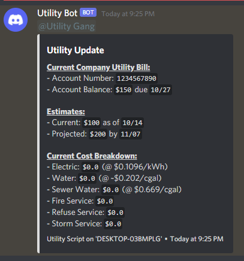

# Utility Scraping Script

A simple Python project to scrape the data from my utility company's web portal and share the data with my roommates' Discord server. :)

Should look like this when implemented properly:



## Usage

1. Clone repo to your machine.
2. Download Firefox and install it to your machine.
3. Download the latest version of [`geckodriver`](https://github.com/mozilla/geckodriver/releases) and add it to your system's path.
4. Run using `python3`.

If you plan on running this on a schedule, might I recommend scheduling it with `launchd` on Mac, or `systemd` on Linux? Examples [here](./assets/scheduling.md).

## Configuration

All configuration is done in config.ini, which doesn't ship with the repo since it contains private info. Copy the example file over to `config.ini` and edit it to your liking.

```ini
[settings]
; whether you want to see firefox do its work or not
headless = true
; deprecated var, never really used anyways
debug = false
; a custom id for your utility company
; this must correspond with a section you define below that contains:
;   name, scraper, username, password, and entry url
vendor = utility_company

[caching]
; whather or not you want to cache your data, makes processing back-to-back way faster
enabled = true
; path, relative to the root of the project, where the cache will be stored
cache_path = cache
; file nomenclature, using strftime format. percent signs must be double escaped.
format = %%Y-%%m-%%d.json

[discord]
; bot name (will override whatever's set in server)
bot_name = Utility Bot
; bot profile pic url (will override whatever's set in server)
bot_pfp = https://via.placeholder.com/50
; discord webhook url to send the message to
post_url = https://discord.com/api/webhooks/...
; the id of the tag to ping inside the update message
ping_id = 1234567890123456

;
; -=- Example Service Provider Definition -=-
;

[utility_company]
; name of service provider
name = Example Company
; name of scraper module you'd wish to use
scraper = ExampleScraper
; the main entrypoint for the utility server
entry_url = https://example.utilities.com/login.aspx
; The username to use for the connection
username = username
; The password to use for the connection
password = password
```

## Custom Scraper Support

Adding support for other scrapers is supported! You can design your own scrapers if you want. Just make a file that meets the `scrape_[name].py` nomenclature, and place it in the `modules/scrapers/` directory. All scrapers in there are loaded at runtime. :)

All custom scraper files must meet the following requirements:

- File must contain a class definition and the setup function.
- Your class should accept having a `Config` passed into its constructor
- Your class should have a `scrape_data()` member function that returns an initialized `UtilityData` object.
- Your setup function should add the scraper to the parent `DataParser` object

Here's an example:

```py
# scrape_example.py

from modules.config import Config
from modules.utilitydata import UtilityData

class ExampleScraper():
    def __init__(self, config: Config):
        self.config = config

    def scrape_data():
        return UtilityData()

def setup(parser, config):
    parser.add_scraper(ExampleScraper(config))
```

After your parser is loaded, you can use it by changing your config.ini's `scraper` key to the name of the class you defined, or in this case: `ExampleScraper`.

**NOTE:** For performance purposes, do not initialize the selenium driver in the `__init__` function! Init is called for each class while iterating over the scrapers directory, and addling large chunks of code to the constructor can add lots of overhead to the script as a whole. I recommend you define a separate function to start selenium up that gets called at the start of `scrape_data()` instead, like I did in `scrape_talgov.py`

## Maintaining/Contributing

I don't really plan on maintaining this long-term, I just thought it would be cool to publish this on my account. PRs are welcome though! :)
